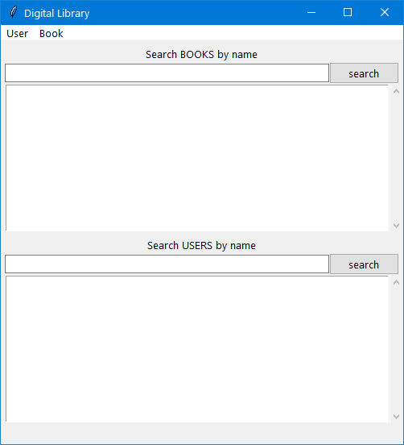
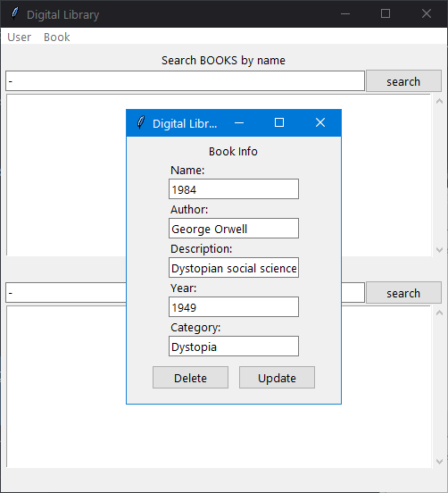
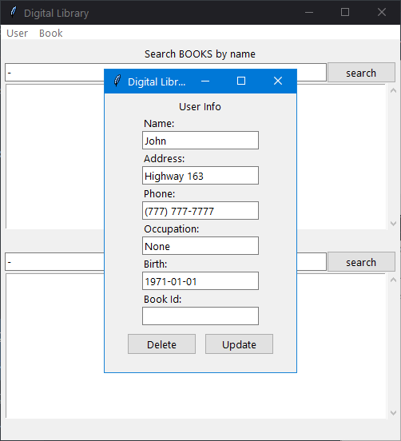
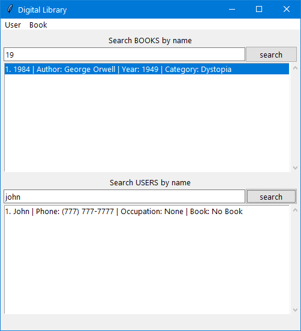
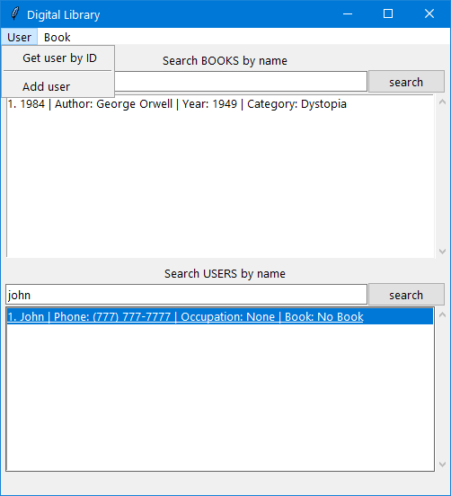

The program implements a book manager. One can:

1. create, read (by id, title), update (by id), and delete (by id) books
2. create, read (by id, name), update (by id), and delete (by id) users 
3. bind a book to a user after getting the user by id.

In order to select all the users or the books, type none in the search line and press the button "search"

1.  
2. 
3. 
4. 
5. 

